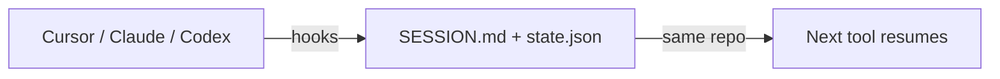

# cross-agent-handoff

[](https://github.com/HN-Tran/cross-agent-handoff/actions/workflows/ci.yml)
[](LICENSE)
[](bin/cross-agent-handoff)
[](docker-compose.yml)

Pass **task state** across AI coding tools — Cursor, Claude Code, Codex, Antigravity, and project chat — without copying full chat transcripts.

> **Handoff, not sync.** A structured baton (`.agent/SESSION.md` + optional digest), not full history replication.  
> Host paths, host git state — whether hooks run natively or via Docker, the files land on your machine.

---

## Features

- **Session inject** on start — agents read `.agent/SESSION.md` automatically  
- **Stop enforcement** — block finish until handoff is updated  
- **Git capture** — branch, dirty files, recent commits in `.agent/state.json`  
- **Project chat** — `export-for-project` / `import` for ChatGPT, Claude, Gemini Projects  
- **Native or Docker** — bash hooks on the host, or `docker compose exec` + `.env`

## How it works

| Layer | File | What it holds |
|-------|------|----------------|
| Static | `AGENTS.md` | Conventions (`CLAUDE.md` → symlink for Claude Code) |
| Dynamic | `.agent/SESSION.md` | Goal, progress, next steps, decisions, blockers, **context digest** |
| Execution | `.agent/state.json` | Branch, dirty files, timestamps (auto) |
| Archive | `.agent/archive/` | Transcript copies (reference only) |



## Install

### Native (recommended for daily use)

```bash
git clone https://github.com/HN-Tran/cross-agent-handoff.git
cd cross-agent-handoff
./install-global.sh --link    # ~/.local/bin/cross-agent-handoff
```

Alias: `cah`

### Docker (compose + `.env`)

```bash
./install-global.sh --docker   # writes ~/.env, wires docker compose exec hooks
cd ~/.local/share/cross-agent-handoff
docker compose up -d --build

docker compose exec -w "$HOME/GitHub/your-repo" cli -- init
```

See [`.env.example`](.env.example) for `HOME`, `UID`, `GID`, and optional clipboard (`COMPOSE_FILE=...clipboard.yml`).

| | Native | Docker |
|--|--------|--------|
| Install | `install-global [--link]` | `install-global --docker` + `up -d` |
| Hooks | Host bash adapters | `docker compose exec` (daemon required) |
| Effect on disk | Same — `.agent/` in your git repo | Same — `$HOME` bind mount |

After install: **restart Cursor**; run **`codex /hooks`** to trust Codex hooks.

## Quick start (per repo)

```bash
cd your-git-repo
cross-agent-handoff init
# Edit .agent/SESSION.md — goal, progress, next steps
```

**Cloud agents** (no gitignored files on the VM):

```bash
cross-agent-handoff init --web-mode
git add .agent/SESSION.md && git commit -m "chore: session handoff" && git push
```

## Validate your setup (pilot checklist)

Use this once on a real repo (e.g. `automation-workflows`):

1. `cross-agent-handoff init`  
2. Fill `.agent/SESSION.md` with a real task  
3. **Cursor** — start session → confirm handoff context appears; stop → confirm SESSION was updated (or stop hook nudges you)  
4. **Claude Code / Codex** — open same repo → agent continues from SESSION + correct branch  
5. Optional: `export-for-project --clipboard` → project chat → `import --from-clipboard`  
6. Optional: `digest` after sessions with transcript archives  

Hooks always affect the **host tree** (or a bind-mounted `$HOME` in Docker) — runtime location does not change where handoff files live.

## CLI

| Command | Purpose |
|---------|---------|
| `init [--web-mode] [DIR]` | `.agent/`, templates, AGENTS section, repo hook stubs |
| `capture [--tool NAME] [--transcript PATH]` | Update `state.json` (+ archive) |
| `export-for-project [--clipboard]` | Brief for project chat |
| `import --from-clipboard \| --from-file PATH` | Pull project-chat text into SESSION |
| `digest` | Latest archive tail + digest hints |
| `install-global [--link] [--docker]` | CLI + user-level hooks (native or compose) |

## Hooks (Tier A)

| Tool | Config | Events |
|------|--------|--------|
| Cursor | `~/.cursor/hooks.json` | `sessionStart`, `stop`, `sessionEnd` |
| Claude Code | `~/.claude/settings.json` | `SessionStart`, `Stop`, `SessionEnd` |
| Codex | `~/.codex/hooks.json` | `SessionStart`, `Stop` |
| Antigravity CLI | `~/.gemini/antigravity-cli/settings.json` | `SessionStart`, `AfterAgent`, `SessionEnd` |

`init` adds **repo-level** stubs for Tier B (cloud). Cursor v2.4+ required for `sessionStart` / `sessionEnd`.

## Project chat (Tier C)

```bash
cross-agent-handoff export-for-project --clipboard
cross-agent-handoff import --from-clipboard
```

[`templates/project-instructions.md`](templates/project-instructions.md) — paste into project settings.

## Coverage

| Tier | Tools | How |
|------|-------|-----|
| A | Local CLIs | Hooks |
| B | Cloud coding agents | Committed hooks + pushed `SESSION.md` |
| C+ | Project chat | export / import |
| D | Ad hoc | Manual paste |

## Development

```bash
# CI runs the same checks locally:
./scripts/ci-smoke.sh

# Dev compose (live-mount sources):
docker compose -f docker-compose.yml -f docker-compose.dev.yml up -d --build
```

## Troubleshooting

| Issue | Fix |
|-------|-----|
| Hooks not firing | Executable bits, paths, `codex /hooks`, restart Cursor |
| Stop loop | Update all SESSION sections, then stop again |
| Docker hook empty | `docker compose up -d`; check `docker ps` |
| Cloud missing context | `init --web-mode` + commit `SESSION.md` |

## License

[Apache-2.0](LICENSE)
